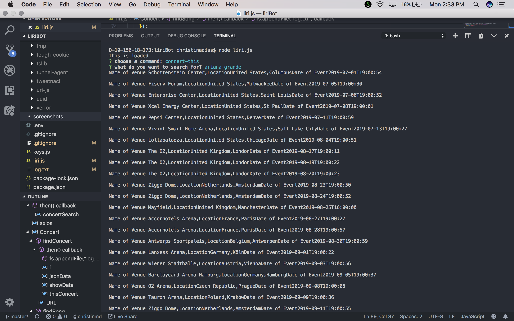
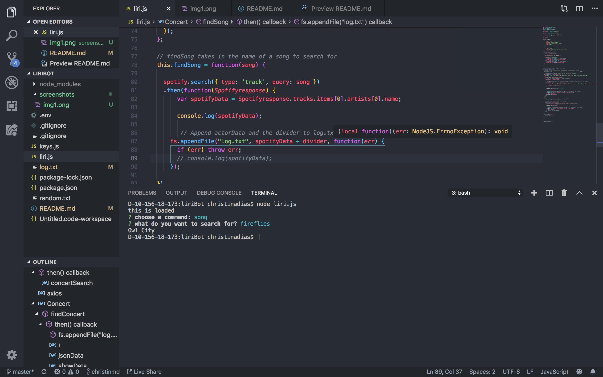

# liriBot

# Overview 

This version of LIRI accepts two commands:

* node liri.js concert-this <artist/band name>

    * source: Bands in Town Artist Events API

* node liri.js spotify-this-song
    * source: Spotify API

The app has several dependencies:

* dotenv
* node-spotify-api
* request (alternative to axios)